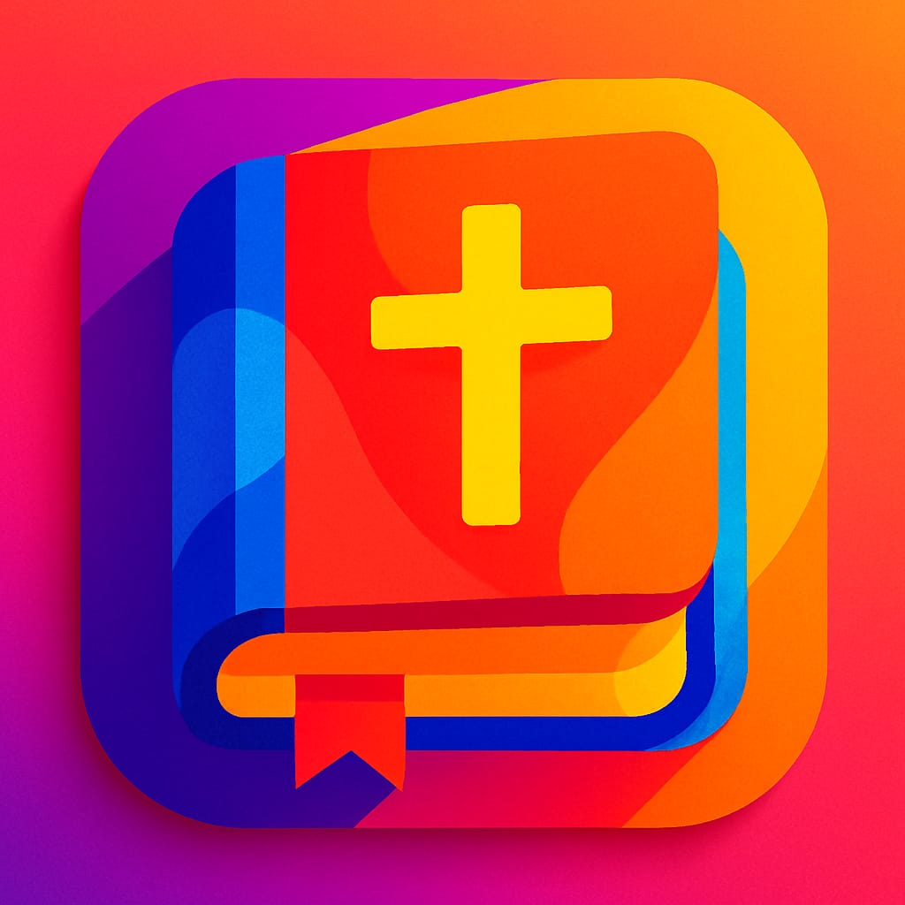
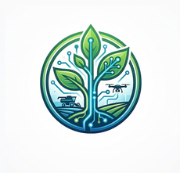

# Ruan Gustavo Soares da Silva

Tive os meus primeiros contatos com a área de TI aos 15 anos quando realizei um curso de informática básica junto a minha mãe, desde então eu adentrei na área e desenvolvi cada vez mais interesse em segurança cibernética e baixo nível.

Tenho capacidade, responsabilidade e interesse para lidar com infraestrutura, engenharia, analise, suporte e gestão ágil de projetos, além de buscar conhecimento e pensamento crítico em como posso fornecer segurança e boa performance em dispositivos antigos e atuais.

Atualmente me encontro graduando em Sistema de Informação, mas pretendo extender para Engenharia de Software e após isso iniciar uma pós-graduação em Segurança da Informação e Hacking Pentester.

---
## 🛠️ Stack Principal
* **Backend:** Java, Typescript, APIs RESTful
* **Frontend:** Flutter, React, Bootstrap, Tailwind
* **Bancos de Dados:** PostgreSQL, MySQL/MariaDB, SQLite, MongoDB
* **DevOps & Infraestrutura:** Docker, Git, Linux
* **Metodologias:** Scrum, Kanban, XP

## 🛠️ Estudos Complementares
* Shell
* C/C++
* Assembly x86_64
* Wget
* cURL
## 🚀 Projetos em Destaque

### <a href="https://play.google.com/store/apps/details?id=com.bibleAplication.app"> Bíblia & Harpa - sem anúncios</a>

<table>
  <tr>
    <td align="center" valign="middle" width="160px">
      
    </td>
    <td valign="top">
      
Aplicativo Mobile para leitura Bíblica e conteúdos sagrados com meta de expansão para Multiplataforma, assim consolidando o público android e almejando alcançar os projetores das igrejas e parte do público IOS.

      
<b>🚀 Tecnologias:</b> Flutter, SharedPreferences, Hive

      
<b>🚀 Arquitetura:</b> Refatorando para MVVM + Service (Provider como View Model)

      
<b>🚀 Automação:</b> GNU/Bash

    </td>
  </tr>
</table>

### 🌾 Agrohub (Feira Virtual e ERP integrados)

<table>
  <tr>
    <td align="center" valign="middle" width="160px">
      
    </td>
    <td valign="top">
      
Uma plataforma integrada que une um <i>marketplace</i> centralizada para o agronegócio (conectando produtores de alimentos diretamente ao consumidor final) e um sistema ERP robusto para gestão corporativa.

      
<b>🚀 Tecnologias:</b> Flutter, SharedPreferences, Sqlite, Java, Spring boot, Postgres, H2, Docker

      
<b>🚀 Arquitetura:</b> Frontend: SetState padrão. Backend: Feature Based + MVC + Service

      
<b>🚀 Automação:</b> GNU/Bash

    </td>
  </tr>
</table>

## 📊 Formação e Certificações

* **Graduação:** Bacharelado em Sistemas de Informação – Unisales *(Em andamento)*
* **Técnico:** Informática Básica - SENAC, Análise e Desenvolvimento de Sistemas – SENAI
* **Idiomas:** Inglês Intermediário – Wizard *(Em andamento)*
* **Complementares:** Introdução ao Hacking e Pentest (Solyd), Design Sprint & Copilot (Enap), Linux (Curso em Vídeo).

---

## Contatos

* **LinkedIn:** [in/ruanslv16](https://linkedin.com/in/ruanslv16)
* **E-mail:** [ruan.work16@gmail.com](mailto:ruan.work16@gmail.com)
