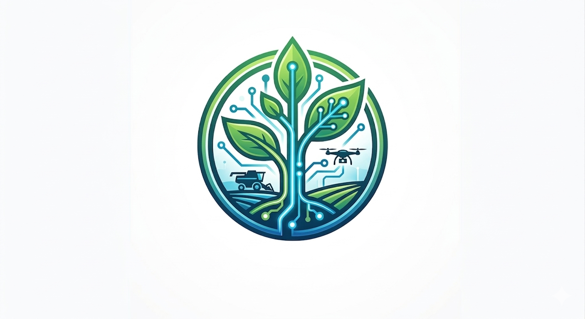

# Olá, eu sou o Ruan! 👋

Para mim, a tecnologia vai além de linhas de código: trata-se de construir soluções eficientes, limpas e seguras. Iniciei minha trajetória na tecnologia aos 15 anos e, desde então, desenvolvi uma forte paixão pela programação. 

Atualmente, sou graduando em **Sistemas de Informação** (5º período) e busco me especializar no setor de **Segurança da Informação**, com foco em aplicações backend e modelagem de bancos de dados.

---
## 🛠️ Stack Principal
* **Backend:** Java (Spring Boot), Typescript, Shell, APIs RESTful
* **Frontend:** Flutter, React, Bootstrap, Tailwind
* **Bancos de Dados:** PostgreSQL, MySQL/MariaDB, SQLite, MongoDB
* **DevOps & Infraestrutura:** Docker, Git, Linux
* **Metodologias:** Scrum, Kanban, XP

## 🛠️ Estudos Complementares
* Shell
* C/C++
* Assembly x86_64
* Wget
* cURL
## 🚀 Projetos em Destaque

### 📱 Bíblia & Harpa (Sem Anúncios)

  

Aplicativo mobile publicado na Google Play Store focado em leitura de texto e áudio de forma fluida. O projeto foi idealizado para aplicar conceitos avançados de interface e entender a fundo as diretrizes de publicação da loja.

---

### 🌾 Agrohub & GerenciaMais (Feira Virtual e ERP)

  

Uma plataforma integrada que une um *marketplace* descentralizado para o agronegócio (conectando produtores de alimentos diretamente ao consumidor final) e um sistema ERP robusto para gestão corporativa.

* **Desafio Técnico:** Modelagem de banco de dados relacional para consistência de inventário e vendas, isolamento de ambientes de desenvolvimento com contêineres e criação de APIs REST seguras e escaláveis.
* **Tecnologias:** Java (Spring Boot), PostgreSQL, MySQL, Docker.

---

## 📊 Formação e Certificações

* **Graduação:** Bacharelado em Sistemas de Informação – Unisales *(Em andamento)*
* **Técnico:** Análise e Desenvolvimento de Sistemas – SENAI
* **Idiomas:** Inglês Intermediário – Wizard *(Em andamento)*
* **Complementares:** Introdução ao Hacking e Pentest (Solyd), Design Sprint & Copilot (Enap), Linux (Curso em Vídeo).

---

## 📫 Vamos nos conectar?

* **LinkedIn:** [in/ruanslv16](https://linkedin.com/in/ruanslv16)
* **GitHub:** [github.com/SilvaRuan16](https://github.com/SilvaRuan16)
* **E-mail:** [ruan.work16@gmail.com](mailto:ruan.work16@gmail.com)
